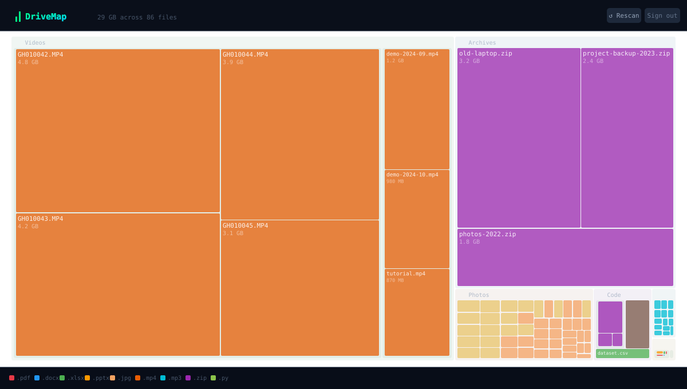

# 📊 DriveMap

> WinDirStat/SpaceMonger-style treemap visualizer for Google Drive — runs entirely in your browser.



## Features

- **Treemap visualization** — rectangles sized proportionally by storage usage
- **Color-coded by file type** — PDFs, videos, images, spreadsheets, code files each get distinct colors
- **Drill-down navigation** — click any folder to zoom in; breadcrumb trail to navigate back
- **Full Drive scan** — paginates the Drive API to index every file
- **Read-only & private** — uses `drive.metadata.readonly` scope; no file contents accessed; nothing sent to any server

---

## Setup (one time)

### 1. Create a Google Cloud Project

1. Go to [console.cloud.google.com](https://console.cloud.google.com/)
2. Create a new project (or select an existing one)
3. Enable the **Google Drive API**:
   - Navigate to **APIs & Services → Library**
   - Search for "Google Drive API" and click **Enable**

### 2. Create OAuth 2.0 Credentials

1. Go to **APIs & Services → Credentials**
2. Click **Create Credentials → OAuth client ID**
3. Choose **Web application**
4. Add your GitHub Pages URL to **Authorized JavaScript origins**:
   ```
   https://YOUR_USERNAME.github.io
   ```
   Also add `http://localhost:5173` for local development.
5. Click **Create** and copy the **Client ID**

### 3. Configure OAuth consent screen

1. Go to **APIs & Services → OAuth consent screen**
2. Choose **External** (or Internal if using Google Workspace)
3. Fill in the app name (e.g. "DriveMap"), support email, and developer email
4. Add the scope: `https://www.googleapis.com/auth/drive.metadata.readonly`
5. Add test users if the app is in "Testing" mode (or publish it)

### 4. Fork & deploy

#### Option A – GitHub Pages (recommended)

1. **Fork** this repository
2. Go to your fork's **Settings → Secrets and variables → Actions**
3. Add a new secret:
   - Name: `VITE_GOOGLE_CLIENT_ID`
   - Value: your Client ID from step 2
4. Go to **Settings → Pages**
   - Source: **GitHub Actions**
5. Push to `main` (or trigger the workflow manually under **Actions**)
6. Your app is live at `https://YOUR_USERNAME.github.io/drivemap/`

#### Option B – Local development

```bash
# Clone your fork
git clone https://github.com/YOUR_USERNAME/drivemap
cd drivemap

# Install dependencies
npm install

# Set your Client ID
echo "VITE_GOOGLE_CLIENT_ID=your_client_id_here" > .env.local

# Start dev server
npm run dev
# → http://localhost:5173
```

---

## Project structure

```
drivemap/
├── src/
│   ├── components/
│   │   ├── LandingScreen.jsx   # Sign-in page
│   │   ├── ScanningScreen.jsx  # Progress indicator
│   │   ├── TreemapScreen.jsx   # Main visualization shell
│   │   └── Treemap.jsx         # D3 treemap renderer
│   ├── hooks/
│   │   ├── useGoogleAuth.js    # OAuth token management
│   │   └── useDriveScanner.js  # Drive API scanning state
│   ├── utils/
│   │   ├── driveApi.js         # Drive API fetch helpers
│   │   ├── treeBuilder.js      # Flat file list → D3 hierarchy
│   │   └── theme.js            # Colors, formatters, constants
│   ├── config.js               # Client ID configuration
│   ├── App.jsx
│   └── main.jsx
├── .github/workflows/deploy.yml
├── index.html
├── package.json
└── vite.config.js
```

---

## Privacy

DriveMap runs **100% in your browser**. It:

- Only requests `drive.metadata.readonly` — the minimum scope needed to read file names and sizes
- Never reads file contents
- Never sends data to any server (there is no backend)
- Never stores your token or file list beyond the current browser session

---

## Tech stack

| Library | Purpose |
|---------|---------|
| [React 18](https://react.dev) | UI framework |
| [Vite](https://vitejs.dev) | Build tool |
| [@react-oauth/google](https://github.com/MomenSherif/react-oauth) | Google OAuth (implicit/token flow) |
| [D3 v7](https://d3js.org) | Treemap layout & SVG rendering |
| [Google Drive API v3](https://developers.google.com/drive/api/v3/reference) | File metadata |

---

## License

MIT
